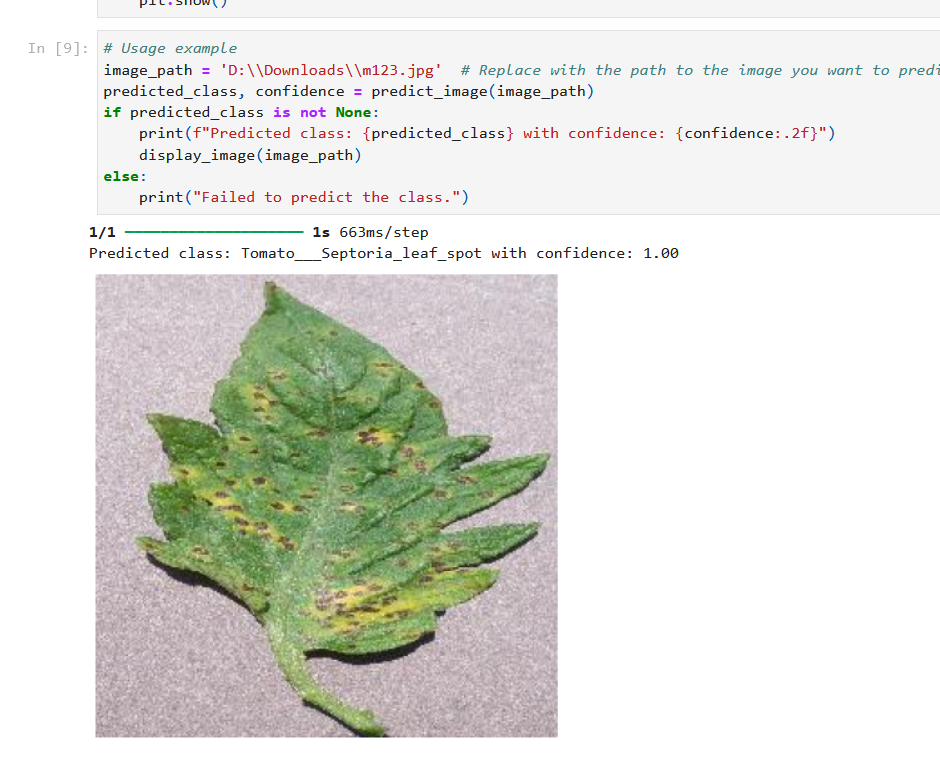

# TOMATO LEAF DISEASE DETECTION

This project provides a **Tomato Leaf Disease Detection** model using deep learning techniques, specifically based on a **VGG16-like architecture** with custom layers. The model is designed to classify tomato leaves into 10 different categories, including diseases such as Bacterial Spot, Early Blight, Late Blight, and more, as well as healthy leaves.

The dataset includes diverse images sourced from farms, family, and friends, ensuring a wide representation of disease conditions.

## Dataset

- You can access the **Tomato Leaf Disease Dataset** published on **Mendeley Data** using the following link:
  - [Tomato Leaf Disease Dataset](https://data.mendeley.com/datasets/zfv4jj7855/1)

The dataset includes images labeled into 10 classes, aiding the model in identifying various leaf conditions with high accuracy.

## Model

- The trained **Tomato Leaf Disease Detection Model** (.h5) is available for download here:
  - [Download .h5 Model](https://mega.nz/file/CyRFGIha#cLUclg8B0iWeFbqOol-uCAPcqVUWCqFhk0_jEMmSHU4)

This model was built using TensorFlow and trained on the dataset to achieve high performance on disease classification.

## Project Structure

- **/notebooks**: Contains Jupyter notebooks used for model training and evaluation.
- **/data**: Dataset used for training and testing the model.
- **/models**: Pre-trained models and saved checkpoints.
- **/app**: The source code for the mobile application integrating the detection model.

## Results

### Laptop Demonstration
This section provides a step-by-step overview of the disease detection process using the desktop version of the software. Below is an image illustrating the detection process:



### Mobile App Prediction
This demonstration shows how users can upload images from their mobile gallery to receive disease predictions. The image below highlights the mobile app's prediction feature:


## Requirements

To run this project locally, make sure you have the following dependencies installed:
- Python 3.x
- TensorFlow
- Keras
- NumPy
- Matplotlib
- OpenCV

Install the required packages using:
```bash
pip install -r requirements.txt
